# Sistema de Reservas para Restaurante - DevOps Integration

[](https://github.com/tiago-appdev/crud-reservas-mongo/actions/workflows/ci-cd.yml)


Este proyecto es un sistema de reservas para un restaurante implementado con prácticas DevOps modernas, incluyendo CI/CD, containerización, monitoreo y deployment automatizado.

## 🏗️ Arquitectura del Sistema

```
┌─────────────────┐    ┌─────────────────┐    ┌─────────────────┐
│   Frontend      │    │   Backend       │    │   Database      │
│   (Pug Views)   │◄──►│   (Node.js)     │◄──►│   (MongoDB)     │
│   Port: 3000    │    │   Express API   │    │   Port: 27017   │
└─────────────────┘    └─────────────────┘    └─────────────────┘
         │                       │                       │
         └───────────────────────┼───────────────────────┘
                                 │
                    ┌─────────────────┐
                    │   Health Check  │
                    │   /health       │
                    │   /ready        │
                    │   /live         │
                    └─────────────────┘
```

## 📋 Tabla de Contenidos

- [Tecnologías](#tecnologías)
- [Instalación y Configuración](#instalación-y-configuración)
- [Desarrollo Local](#desarrollo-local)
- [Docker & Containerización](#docker--containerización)
- [CI/CD Pipeline](#cicd-pipeline)
- [Deployment](#deployment)
- [Monitoreo y Health Checks](#monitoreo-y-health-checks)
- [Testing](#testing)
- [API Documentation](#api-documentation)
- [Troubleshooting](#troubleshooting)

## 🚀 Tecnologías

### Backend
- **Node.js 20+** - Entorno de ejecución
- **Express.js** - Framework web
- **MongoDB** - Base de datos NoSQL
- **Mongoose** - ODM para MongoDB
- **JWT** - Autenticación
- **bcrypt** - Hash de contraseñas
- **Nodemailer** - Envío de emails

### Frontend
- **Pug** - Motor de plantillas
- **Bootstrap 5** - Framework CSS
- **Vanilla JavaScript** - Interactividad

### DevOps & Infrastructure
- **Docker** - Containerización
- **Docker Compose** - Orquestación local
- **GitHub Actions** - CI/CD
- **ESLint** - Linting de código
- **Jest** - Testing framework
- **Prometheus** - Monitoreo (opcional)
- **Grafana** - Dashboards (opcional)

## 📦 Instalación y Configuración

### Requisitos Previos

- [Node.js](https://nodejs.org/) 20+ y npm
- [Docker](https://docker.com/) y Docker Compose
- [Git](https://git-scm.com/)
- [MongoDB](https://mongodb.com/) (opcional para desarrollo local)

### 1. Clonar el Repositorio

```bash
git clone https://github.com/tiago-appdev/crud-reservas-mongo.git
cd crud-reservas-mongo
```

### 2. Instalar Dependencias

```bash
npm install
```

### 3. Configurar Variables de Entorno

Crear archivo `.env` basado en `.env.example`:

```bash
cp .env.example .env
```

Configurar las variables necesarias:

```env
# Application
PORT=3000
NODE_ENV=development
JWT_SECRET=your-super-secret-jwt-key

# Database
MONGODB_URI=mongodb://localhost:27017/restaurant-reservations

# Email Service
EMAIL_USER=your-email@gmail.com
EMAIL_PASS=your-app-password

# Deployment
DOMAIN=localhost
FRONTEND_URL=http://localhost:3000
```

### 4. Inicializar Base de Datos

```bash
# Ejecutar migraciones
npm run migrate

# Poblar con datos de ejemplo (opcional)
npm run seed
```

## 🛠️ Desarrollo Local

### Método 1: Desarrollo Tradicional

```bash
# Iniciar MongoDB localmente
mongod

# Ejecutar la aplicación en modo desarrollo
npm run dev
```

### Método 2: Con Docker Compose (Recomendado)

```bash
# Construir e iniciar todos los servicios
npm run docker:compose:up

# Ver logs en tiempo real
npm run docker:compose:logs

# Detener servicios
npm run docker:compose:down
```

La aplicación estará disponible en:
- **Frontend**: http://localhost:3000
- **API**: http://localhost:3000/api
- **Health Check**: http://localhost:3000/health

### Usuarios de Prueba (después del seed)

```
Admin:
- Email: admin@restaurant.com
- Password: admin123

Clientes:
- Email: john@example.com
- Password: client123
```

## 🐳 Docker & Containerización

### Dockerfile Multi-stage

El proyecto utiliza un Dockerfile multi-stage optimizado:

- **Base**: Configuración común con Alpine Linux
- **Development**: Incluye herramientas de desarrollo
- **Dependencies**: Solo dependencias de producción
- **Build**: Ejecuta linting y tests
- **Production**: Imagen final optimizada

### Docker

```bash
# Para levantar el proyecto entero
docker-compose up --build -d
```

## ⚙️ CI/CD Pipeline

### GitHub Actions Workflow

El pipeline incluye:

1. **Test Stage**
   - Linting con ESLint
   - Tests unitarios con Jest
   - Coverage reporting
   - MongoDB en memoria para tests

2. **Build Stage**
   - Multi-platform Docker build (AMD64, ARM64)
   - Push a GitHub Container Registry
   - Versionado automático con tags

3. **Deploy Stages**
   - **Staging**: Deploy automático desde `develop`
   - **Production**: Deploy automático desde `main`

### Pipeline Diagram

```mermaid
graph LR
    A[Push/PR] --> B[Lint & Test]
    B --> C{Tests Pass?}
    C -->|Yes| D[Build Docker Image]
    C -->|No| E[❌ Fail]
    D --> F[Push to Registry]
    F --> G{Branch?}
    G -->|develop| H[Deploy to Staging]
    G -->|main| I[Deploy to Production]
    H --> J[✅ Staging Ready]
    I --> K[✅ Production Ready]
```



### Configurar GitHub Actions

1. Agregar secrets en GitHub:
   ```
   DOCKER_USERNAME
   DOCKER_PASSWORD
   MONGODB_URI (staging/prod)
   JWT_SECRET
   EMAIL_USER
   EMAIL_PASS
   ```

2. Habilitar GitHub Container Registry
3. Configurar environments (`production`)

## 🚀 Deployment


#### Render

1. Conectar repositorio de GitHub
2. Configurar variables de entorno
3. Deploy automático configurado en el CI/CD pipeline


## 📊 Monitoreo y Health Checks

### Health Check Endpoints

- **`/health`**: Status básico de la aplicación
- **`/health/detailed`**: Status detallado con DB y memoria
- **`/ready`**: Readiness probe para K8s
- **`/live`**: Liveness probe para K8s

### Ejemplo de Respuesta

```json
{
  "status": "OK",
  "timestamp": "2024-12-12T10:30:00.000Z",
  "uptime": 3600,
  "environment": "production",
  "checks": {
    "database": "connected",
    "memory": {
      "used": "45.2 MB",
      "total": "128.0 MB",
      "usage": "35.3%",
      "status": "ok"
    }
  }
}
```

### Monitoreo con Prometheus (Opcional)

```bash
# Iniciar con monitoreo
docker-compose --profile monitoring up -d

# Acceder a dashboards
# Prometheus: http://localhost:9090
# Grafana: http://localhost:3001 (admin/admin)
```

## 🧪 Testing

### Estructura de Tests

```
src/tests/
├── setup.js                 # Configuración global
├── controllers/
│   ├── user.controllers.test.js
│   ├── reservation.controllers.test.js
│   ├── table.controllers.test.js
│   └── admin.controllers.test.js
└── playwright-tests/             
```

### Comandos de Testing

```bash
# Ejecutar todos los tests
npm test

# Tests en modo watch
npm run test:watch

# Coverage report
npm run test:coverage

# Tests para CI
npm run test:ci
```

### Coverage Goals

- **Statements**: > 80%
- **Branches**: > 70%
- **Functions**: > 80%
- **Lines**: > 80%

## 📚 API Documentation

### Autenticación

```bash
# Registro
POST /api/users/register
{
  "name": "Usuario",
  "email": "user@example.com", 
  "password": "password123"
}

# Login
POST /api/users/login
{
  "email": "user@example.com",
  "password": "password123"
}
```

### Reservas

```bash
# Crear reserva
POST /api/reservations
Authorization: Cookie with JWT
{
  "table_id": "507f1f77bcf86cd799439011",
  "date": "2024-12-25",
  "time": "19:00",
  "guests": 4
}

# Obtener mis reservas
GET /api/reservations/my
Authorization: Cookie with JWT
```

### Mesas

```bash
# Buscar mesas disponibles
GET /api/tables/available?date=2024-12-25&time=19:00&party_size=4

# Crear mesa (admin)
POST /api/tables
Authorization: Cookie with JWT (admin role)
{
  "table_number": 1,
  "capacity": 4
}
```

### Admin Dashboard

```bash
# Dashboard data
GET /api/admin/dashboard
Authorization: Cookie with JWT (admin role)

# Reporte de ocupación
GET /api/admin/occupancy-report?startDate=2024-12-01&endDate=2024-12-31
Authorization: Cookie with JWT (admin role)
```

## 🔧 Troubleshooting

### Problemas Comunes

#### 1. Error de Conexión a MongoDB

```bash
# Verificar que MongoDB esté corriendo
docker-compose ps

# Ver logs de MongoDB
docker-compose logs reservasdb

# Reiniciar servicio
docker-compose restart reservasdb
```

#### 2. Tests Fallando

```bash
# Limpiar cache de Jest
npm test -- --clearCache

# Verificar variables de entorno
echo $NODE_ENV
```

#### 3. Build de Docker Fallando

```bash
# Limpiar build cache
docker system prune -a

# Build verbose
docker build --no-cache --progress=plain .
```

#### 4. Issues con Health Checks

```bash
# Verificar endpoints manualmente
curl http://localhost:3000/health
curl http://localhost:3000/ready

# Verificar logs de la aplicación
docker-compose logs app
```

### Logs y Debugging

```bash
# Ver logs en tiempo real
docker-compose logs -f app

# Debug específico de un servicio
docker-compose logs reservasdb

# Acceder al contenedor
docker-compose exec app sh

# Ver métricas del sistema
docker stats
```

## 🤝 Contribución

### Workflow de Desarrollo

1. **Fork** del repositorio
2. Crear **feature branch**: `git checkout -b feature/nueva-funcionalidad`
3. **Commits** con mensajes descriptivos
4. **Push** y crear **Pull Request**
5. Esperar **review** y **approval**

### Estándares de Código

- **ESLint** para JavaScript
- **Prettier** para formateo
- **Conventional Commits** para mensajes
- **Tests** obligatorios para nuevas funcionalidades

## 📄 Licencia

Este proyecto está bajo la licencia MIT. Ver el archivo [LICENSE](./LICENSE) para más detalles.


## 📈 Métricas del Proyecto

- **Lines of Code**: ~2,500
- **Test Coverage**: 85%+
- **Docker Image Size**: <150MB
- **Build Time**: <5 minutes
- **Deployment Time**: <2 minutes
